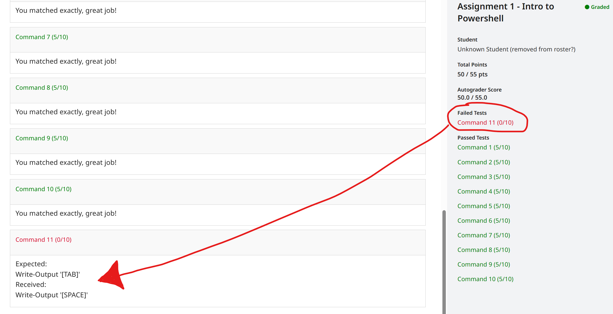

# Assignment 1
## Basic PowerShell Skills

# Instructions

For these exercises, create a PowerShell script containing several individual commands as described in the exercise instructions. Save this script in a file named `A1E1.ps1`.  Submit this script file to Gradescope Assignment 1.

This assignment is designed to test your basic PowerShell skills. It's important to pay attention to detail in each exercise and any feedback received from the autograder.  If you receive errors you do not understand, please email your instructor.  He can see your code submissions and the gradescope output so there is no need to attach screenshots or script files for anything that is already submitted to Gradescope.


# Template Script

Start with the following template script. This will serve as a foundation for your assignment:

```powershell
# Name: [Your Name]
# Student ID: [Your Student ID]
# Section: [Your Section]

### Example Question

Get-ChildItem -Path 'Documents' -Filter *.pptx

### Command 1
Put your code here

### Command 2
bing

### Command 3
foo

### Command 4
bar

### ... Continue for each Command with the appropriate responses

```

### Example Command: List Files with .pptx extension

Type the command to list all files with the  `.pptx` files in the `Documents` folder.

```powershell
Get-ChildItem -Path 'Documents' -Filter '*.pptx'
```

### Command 1: List Files in the Current Working Directory

Type the command to list the files in the current working directory.

### Command 2: Create a Directory

Type the command to create a **new item**, of the *type* `directory` with the *name* `PSTemp`.

### Command 3: Multiple Directories

Type the command to create multiple directories `ExampleDirOne` and `ExampleDirTwo` in the "root directory".  
In windows, you would use a Drive letter but for this assignment please use the *path* `/` (forward slash) as it is now universal to all Operating Systems for root directory.  For example:  `Get-ChildItem -path \` works on Windows and Linux.  The autograder for this assignment uses linux.

### Command 4: New File

Type the command to create a new file called `MonsterBash.txt` in the relative Directory `./PSTemp` that you created in Command 2.

### Command 5: Create File with Spaces

Type the command to create a new file called `Monster Bash.txt` in the relative directory `./PSTemp` that you created in Command 2.

### Command 6: Get-Location Help

Type the command to get help about the cmdlet `Get-Location`.

### Command 7: Online Help for Cmdlet

Type the command to get online help for the cmdlet `Stop-Process`.

### Command 8: Stop Processes

Type the command to stop all services that have names **starting** with the string 'note'.  A similar example would be `start-process -name calc*` which would start all processes beginning with the string 'calc'.  You want to stop processes beginning with note. 

### Command 9: PowerShell Version

Type the command that will **Write the Ouput** of this silly looking value: `$PSversionTable.PSVersion`

### Command 10: Your favourite Key on the keyboard

Type the command that will **Write the Output** of the best keyboard key in scripting in this format: `Write-output [ESC]` or `Write-Output [SPACE]`

---
Remember to replace placeholders like `[YourUsername]` with actual values.

## Submitting to Gradescope

If you missed the introduction class, you will have to upload files and review the feedback you receive from the autograder environment for each assignment. 

There are several ways to solve each of these commands - so the autograder will tell you what it is looking for within the failure message.  

I strongly recommend you type them each out, even though you can easily copy and paste.  It will help you learn how commas, spaces, hyphens and other scripting characteristics work. 



Click on any failed test and see the output for clues / indicators / error messages for you to fix.  Assignment 1 has these errors extremely obvious but they will require more critical thinking as the semester progresses. 

### Good luck!